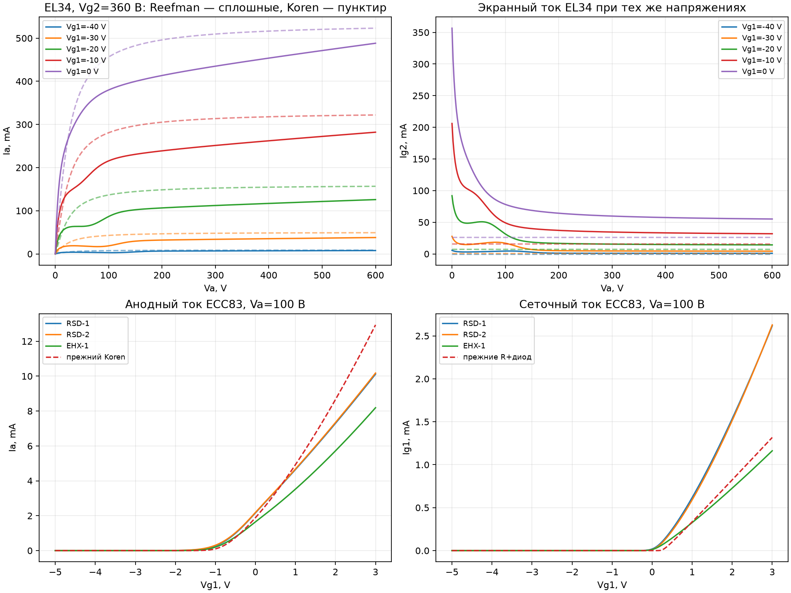
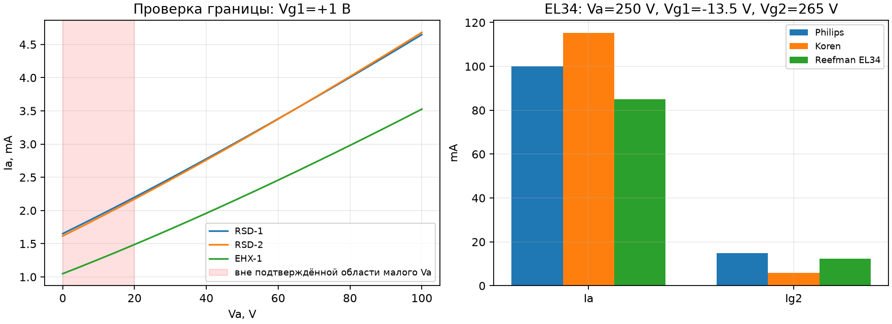

# Отдельная проверка подробных ламповых законов

Ветка `research/detailed-tube-validation`. Усилитель и старый опыт `tube_validation` не изменены.
Новые токи пока не подключены в общий MNA. Подбора параметров по Philips в этом опыте нет.

EL34: рациональная модель Reefman со вторичной эмиссией, исходные коэффициенты авторской TubeLib.
ECC83: три набора измеренных 12AX7 из Dempwolf–Zölzer. Название лампы не делает эти экземпляры Philips 1970.

## Численная проверка

Независимый ngspice: 38 развёрток, 3590 DC-точек; максимальная разность токов 8.365e-15 А.
EL34 сверена с исходными выражениями авторской библиотеки после описанной адаптации синтаксиса.
Учтён отдельный анодный резистор 1 ГОм. Для ECC83 SPICE-выражения записаны отдельно по статье.
Производные проверены центральными разностями; все заданные критерии пройдены.

| Модель | Точек якобиана | Максимальная ошибка, А/В |
|:---|---:|---:|
| RSD-1 | 35 | 8.702e-12 |
| RSD-2 | 35 | 1.101e-11 |
| EHX-1 | 35 | 4.278e-12 |
| Reefman | 252 | 9.773e-12 |

## Табличные точки Philips

Проверены по изображениям страницы 2 обоих даташитов. Вторая экранная точка 245 В выведена из 265 В − 2 кОм × 10 мА.
Крутизна для колонки с экранным резистором здесь не сравнивается: условия малого сигнала требуют отдельного определения.

| Лампа/модель | Va / Vg1 / Vg2, В | Ia, мА | Philips Ia, мА | Ig2, мА | Philips Ig2, мА |
|:---|:---|---:|---:|---:|---:|
| ECC83 Koren | 100 / -1 / — | 0.1004 | 0.5 | — | — |
| ECC83 DZ RSD-1 | 100 / -1 / — | 0.2743 | 0.5 | — | — |
| ECC83 DZ RSD-2 | 100 / -1 / — | 0.3061 | 0.5 | — | — |
| ECC83 DZ EHX-1 | 100 / -1 / — | 0.2000 | 0.5 | — | — |
| ECC83 Koren | 250 / -2 / — | 0.9518 | 1.2 | — | — |
| ECC83 DZ RSD-1 | 250 / -2 / — | 0.9013 | 1.2 | — | — |
| ECC83 DZ RSD-2 | 250 / -2 / — | 1.0198 | 1.2 | — | — |
| ECC83 DZ EHX-1 | 250 / -2 / — | 1.1553 | 1.2 | — | — |
| EL34 Koren | 250 / -13.5 / 265 | 115.2103 | 100 | 5.7598 | 14.9 |
| EL34 Reefman EL34 | 250 / -13.5 / 265 | 85.0572 | 100 | 12.3231 | 14.9 |
| EL34 Koren | 250 / -14.5 / 245 | 79.5263 | 70 | 3.7934 | 10 |
| EL34 Reefman EL34 | 250 / -14.5 / 245 | 57.4896 | 70 | 8.3291 | 10 |

| ECC83 модель | Va, В | gm, мА/В | Philips gm, мА/В |
|:---|---:|---:|---:|
| Koren | 100 | 0.5876 | 1.25 |
| DZ RSD-1 | 100 | 0.8674 | 1.25 |
| DZ RSD-2 | 100 | 0.9030 | 1.25 |
| DZ EHX-1 | 100 | 0.7480 | 1.25 |
| Koren | 250 | 1.6700 | 1.6 |
| DZ RSD-1 | 250 | 1.8911 | 1.6 |
| DZ RSD-2 | 250 | 1.9543 | 1.6 |
| DZ EHX-1 | 250 | 1.7375 | 1.6 |

## Проверка прежнего дефекта экрана

При одинаковых Va=463.1 В, Vg1=-47.6784 В, Vg2=462.7536 В:
Koren Ia/Ig2 = 20.9698/0.0000 мА; Reefman = 16.7561/2.0356 мА.
Это точечный тест при напряжениях прежнего опыта, а не пересчитанная рабочая точка усилителя.

## Экранный резистор как отдельная связанная цепь

Va=250 В, Vg1=−14,5 В, экран питается от 265 В через 2 кОм. Решено Vs+R·Ig2=265 В.
Philips: Ia=70 мА, Ig2=10 мА (Vs=245 В).

| Модель | Vs, В | Ia, мА | Ig2, мА | Невязка, А |
|:---|---:|---:|---:|---:|
| Koren | 256.0593 | 92.0143 | 4.4704 | -5.204e-18 |
| Reefman | 247.6942 | 59.7246 | 8.6529 | -1.735e-18 |

## Ограничения и решение

Ненулевой экранный ток и согласие со SPICE устраняют конкретный дефект прежнего закона, но не аттестуют лампу по всему диапазону.
При Va=250 В, Vg1=−80 В, Vg2=465/550 В модель даёт обратный суммарный анодный ток. Вторичная эмиссия в принципе допускает такой знак; без независимых данных эти точки остаются неподтверждённой экстраполяцией, а не доказанной ошибкой формулы.
Положительный сеточный ток EL34 в авторском наборе всё ещё представлен R+полупроводниковым диодом; проверенной модели AB2 пока нет.
Dempwolf–Zölzer при Va<20 В и положительной сетке не воспроизводит спад Ia к нулю. Стенд сохраняет этот отрицательный результат без скрытого ограничения тока.
Reefman не продолжен на отрицательный анод и неположительный экран. Эти области явно отвергаются до выбора обоснованного продолжения для пробных точек Ньютона.
Проверка статическая: ёмкости, прогрев, динамический сеточный заряд и реальные музыкальные атаки этим опытом не аттестованы.
Совпадение с полными измеренными семействами не проверено: исходные сырые uTracer-данные EL34 в скачанном пакете не найдены. Табличные точки не заменяют такие измерения.
Следующий опыт: расширить независимые данные характеристик, проверить область траекторий ламп усилителя; затем выбирать модель и подключать её в MNA.





## Воспроизведение и источники

```sh
.venv/bin/python reference/fetch_tube_validation.py
.venv/bin/python simulation/run_tube_validation.py
```

Требуются зависимости `requirements.txt`, ngspice; для первой распаковки авторского архива — 7zz/7z.
[Dempwolf–Zölzer, 2011](https://dafx.de/paper-archive/2011/Papers/76_e.pdf),
[Reefman, PDF с датой 14.03.2019](https://www.dos4ever.com/uTracer3/EM4_Theory.pdf),
[авторская библиотека в ExtractModel](https://www.dos4ever.com/uTracer3/uTracer3_pag14.html),
[Philips ECC83](https://www.drtube.com/datasheets/ecc83-philips1970.pdf),
[Philips EL34](https://www.drtube.com/datasheets/el34-philips1969.pdf).

URL и SHA-256 сохранены в `reference/tube_validation_sources.json`. Сторонние оригиналы и сырые SPICE-трассы вне Git.
Версии среды, хеши программ, результаты всех сравнений и отрицательные диагностические точки — в `metrics.json`.
