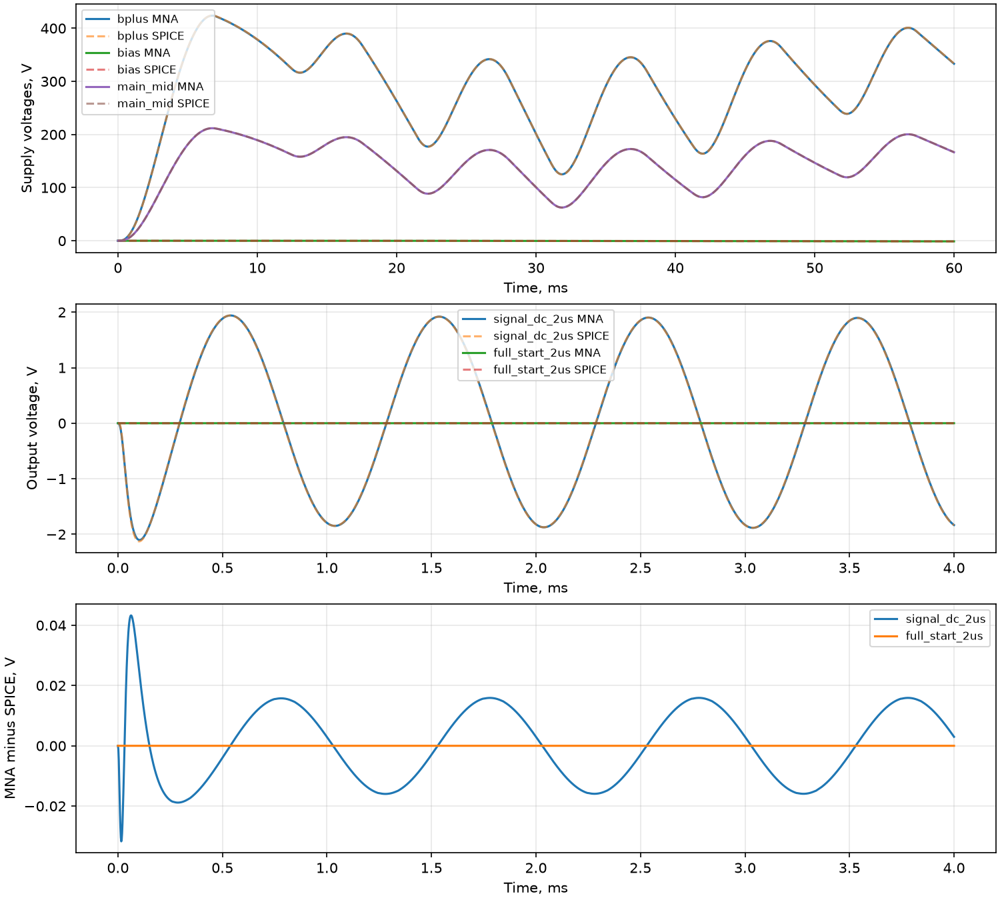

# Полная схема и собственный общий решатель

Реализован общий MNA float64 с аналитическим якобианом, демпфированным Ньютоном
и неявным Эйлером. Узлы не исключаются, каскады не разрываются. Нелинейные
заряды переходов входят в дискретное уравнение заряда, а не заменены постоянной ёмкостью.

SPICE получает тот же список элементов и ламповые законы, но решает их своим алгоритмом.
Диоды экспортированы нативными D-моделями с теми же Is/Cjo/Vj/M/Fc/Tt;
численные продолжения диодного тока в SPICE могут отличаться от Python.
SPICE: Gear maxord=2, reltol=1e-7, abstol=1e-12 A, vntol=1e-9 V.
Максимальный шаг SPICE в четыре раза меньше шага Python. Поэтому временная
разность включает ошибку сетки и разницу интеграторов; это не изолированная ошибка реализации решателя.

Вход 1 мВ peak, 1 кГц; Gain/Master — электрические доли 0,1, остальные ручки 0,5.
В полном варианте сеть 230 В RMS, 50 Гц, старт из нулевого электрического состояния.
Эмиссия ламп считается установившейся: тепловой прогрев не моделируется.

| Опыт | Узлов / неизвестных | Время, мс | DC max, В | KCL max, А | RMS выхода к SPICE, В | Делений шага |
|:---|:---|---:|---:|---:|---:|---:|
| signal_dc_2us | 68 / 76 | 4 | 5.433e-07 | 8.867e-11 | 1.247e-02 | 0 |
| full_start_2us | 90 / 104 | 4 | 6.941e-19 | 9.937e-11 | 9.732e-08 | 0 |
| signal_dc_05us | 68 / 76 | 4 | 5.433e-07 | 9.951e-11 | 3.143e-03 | 0 |
| full_start_60ms | 90 / 104 | 60 | 6.941e-19 | 9.990e-11 | 8.979e-05 | 0 |

Максимальная относительная ошибка проверки аналитического якобиана: 1.541e-08.
При несходимости состояние не записывается; интервал делится пополам с ограничением
глубины. DC использует продолжение по источникам и заканчивается исходной системой.

Добавлены мост, средняя точка HV, отдельная обмотка и выпрямитель bias, фильтры
10 мкФ / 15 кОм / 10 мкФ, 56 кОм + регулятор 22 кОм (электрическая половина),
нагрузка накала и реальные ветви отводов OT 4/8/16 Ом с током обратной связи.

Параметры магнитных элементов и выпрямителей, отсутствующие на схеме, всё ещё
предварительные. Начальные законы Koren сохранены как контроль реализации;
их физические ограничения не устранены написанием решателя. Этот опыт не доказывает
точность конкретного серийного Marshall, магнитное насыщение или установившийся прогрев.

?????: 60 ?? ???????? ?????? ?? ???????????? ?????????????? ?????.
? ??????????? ?????? ??????? bias ? ????? ????? ?1,14 ?, Bpi ????? 7,61 ?;
???????? ??????? ? ???????? ??? ??????????. ??????? DC ????? ???????? ?
????????? ??????????? ?????????. ???????? ????????? ???????? ?????? ???????
?????????? ???????????? ??????? ? ??????????? ???????.
