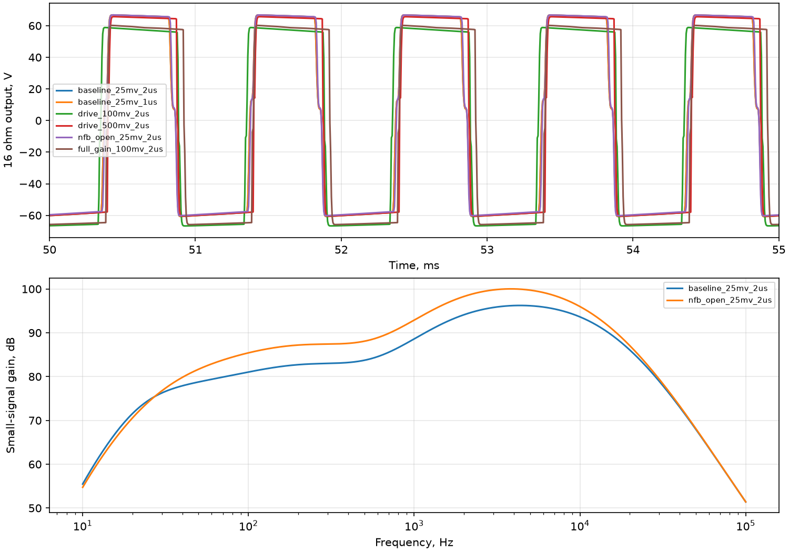

# Первый полный SPICE-прототип 2203 (1981)

Автоматический отчёт `simulation/run_reference.py`. Это численный прототип,
ещё не аттестованный эталон конкретного усилителя. См. ограничения в `docs/03 Модель.md`.

ngspice, Gear порядка не выше 2, reltol=1e-6, abstol=1e-11 A, vntol=1e-8 V.
Синус 1 кГц, длительность 60 мс, старт из рабочей точки. RMS последних 20 мс;
электрическая нагрузка 16 Ом. Bass/Mid/Treble/Presence=0,5; Gain/Master в таблице.
Позиции потенциометров — электрические доли сопротивления, не шкала ручек.

| Опыт | Вход, В peak | Gain/Master | Шаг max, мкс | Выход peak, В | Мощность, Вт |
|:---|---:|---:|---:|---:|---:|
| baseline_25mv_2us | 0.025 | 0.5 | 2 | 77.86878 | 225.09141 |
| baseline_25mv_1us | 0.025 | 0.5 | 1 | 77.86877 | 225.08969 |
| drive_100mv_2us | 0.1 | 0.5 | 2 | 77.87643 | 228.78794 |
| drive_500mv_2us | 0.5 | 0.5 | 2 | 77.91372 | 235.07988 |
| nfb_open_25mv_2us | 0.025 | 0.5 | 2 | 77.88105 | 226.11534 |
| full_gain_100mv_2us | 0.1 | 0.999 | 2 | 77.91303 | 233.63633 |

Уменьшение максимального шага 2 → 1 мкс: разность выхода 0.003927% RMS.
Это локальная проверка одного сигнала; общая сходимость сетки ещё не установлена.

## Рабочая точка

| Узел | В |
|:---|---:|
| p1 | 220.557273 |
| k1 | 1.826200 |
| p2 | 261.220040 |
| k2 | 2.697429 |
| p3 | 173.781741 |
| k3 | 1.015765 |
| cf | 174.078454 |
| bpre1 | 288.194425 |
| bpre2 | 297.655579 |
| bpi | 336.911972 |
| pi_p1 | 228.234057 |
| pi_p2 | 220.860718 |
| pi_k | 37.185914 |
| pi_tail | 36.017564 |
| feedback | 11.159034 |
| bplus | 466.215530 |
| bscreen | 465.141818 |
| plate_a | 464.663313 |
| plate_b | 464.775781 |
| bias | -42.000000 |
| s4 | 465.098673 |
| out | 0.000000 |

Все записанные значения конечны, переходные расчёты достигли 60 мс.
Аппаратные такты STM32N6 не измерялись. Сетевые пульсации, магнитное насыщение
и акустический кабинет отсутствуют. Параметры источника питания предварительные.
