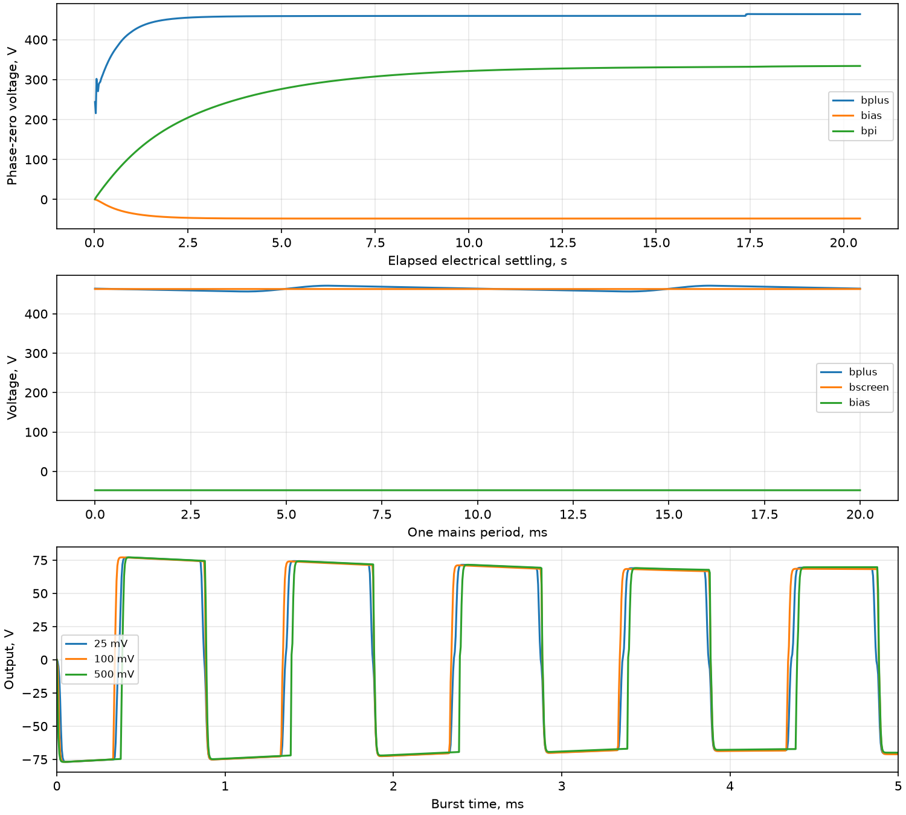

# Установление питания, баланс мощности и сильный сигнал

Полная MNA: 90 узлов / 104 неизвестных, без исключения каскадов. Лампы считаются горячими.
Сеть 230 В RMS / 50 Гц, нагрузка 16 Ом; все ручки электрически 0,5.
Начальные магнитные и ламповые параметры прежние; совпадение с реальным усилителем не заявляется.

## Критерий установления

Сравниваются ВСЕ напряжения и токи ветвей на всей сетке двух соседних периодов сети.
Допуски: 10 мВ и 20 мкА, три периода подряд. Инициализация шагом 1 мс,
затем повторное установление шагом 100 мкс. Критерий проверяет периодичность при этом шаге,
а не отсутствие ошибки дискретизации. Все нелинейности сохранены на обеих сетках.
Принятое время электрического установления: 20.440 с.

| Узел | Среднее, В | Размах пульсаций, В |
|:---|---:|---:|
| bplus | 463.809691 | 14.783694 |
| bscreen | 462.753633 | 0.199102 |
| bpi | 334.166583 | 0.006712 |
| bpre2 | 294.836921 | 0.008442 |
| bpre1 | 285.232505 | 0.009645 |
| bias | -47.678437 | 0.017296 |
| out | 0.000018 | 0.000089 |

## Баланс за период без сигнала

Источник отдаёт энергию резисторам, токовым ветвям ламп/диодов, накопителям
и численной диссипации неявного Эйлера. Последняя учитывается отдельно:
она не является физическим нагревом. Включены взаимные индуктивности и
энергия нелинейных зарядов диодов. Накал представлен резистивной нагрузкой.

| Составляющая | Средняя мощность, Вт |
|:---|---:|
| sources | 88.018912704 |
| resistors | 47.793614569 |
| nonlinear_devices | 40.037698689 |
| storage_change | 0.024600936 |
| backward_euler_loss | 0.162998510 |

Максимальная невязка мгновенного дискретного баланса: 5.613e-09 Вт.
Замыкание баланса проверяет учёт токов и энергии, но само по себе не аттестует физические параметры.

## EL34 без сигнала

| Лампа | Ia, мА | Ig2, мА | Pa, Вт | Pg2, Вт |
|:---|---:|---:|---:|---:|
| Xv4 | 20.974263 | 0.000000 | 9.713420 | 0.000000 |
| Xv5 | 20.974263 | 0.000000 | 9.713420 | 0.000000 |
| Xv6 | 20.973404 | 0.000000 | 9.714078 | 0.000000 |
| Xv7 | 20.973404 | 0.000000 | 9.714078 | 0.000000 |

## Сильный сигнал

Каждый опыт начинается из одного принятого периодического состояния: 20 мс синуса
1 кГц (шаг 5 мкс), затем 20 мс без входа (10 мкс). Это атака и короткое восстановление,
а не установившаяся перегрузка. Шаг нового опыта отличается от сетки инициализации.

| Вход peak, мВ | Выход RMS, В | Нагрузка, Вт | KCL max, А | Баланс max, Вт |
|---:|---:|---:|---:|---:|
| 25 | 65.032532 | 264.326891 | 9.978e-11 | 5.197e-08 |
| 100 | 65.930790 | 271.679318 | 9.983e-11 | 8.950e-08 |
| 500 | 66.291141 | 274.657212 | 9.790e-11 | 1.140e-07 |

100 мВ: разность с ngspice Gear до 2-го порядка / maxstep 1 мкс — 2.561552% RMS.
Оба расчёта начинают с одних узловых напряжений и токов индуктивностей;
SPICE не устанавливает питание заново. Разность включает интеграторы и сетки.

## Интерпретация и ограничения

Нулевой Ig2 при анодном токе около 21 мА — ограничение текущего закона EL34:
экранная ветвь обнуляется при Vs/11 + Vg <= 0. Сходимость Ньютона и совпадение
со SPICE не подтверждают этот закон физически; нужна отдельная проверка экранных характеристик.

264–275 Вт в нагрузке относятся только к первым 20 мс атаки. Накопители отдают
в среднем 141–147 Вт; это не проверка длительной паспортной мощности 100 Вт.
После 20 мс отключённого входа выход ещё не вернулся к покою; полное восстановление не измерено.

Для атак 25/100/500 мВ потребовалось соответственно 15/42/55 делений шага после
неудачи Ньютона. Это проверяет защитный механизм на данных опытах, но не даёт гарантии
для любого входа. Разность со SPICE 2,56% требует отдельного сгущения сетки в перегрузке;
сходимость по шагу предыдущего малосигнального опыта на этот режим не переносится.

