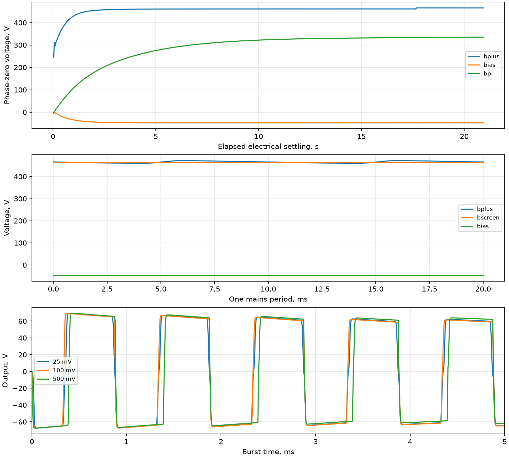

# Установление питания, баланс мощности и сильный сигнал

Полная MNA: 90 узлов / 104 неизвестных, без исключения каскадов. Лампы считаются горячими.
Сеть 230 В RMS / 50 Гц, нагрузка 16 Ом; все ручки электрически 0,5.
Набор ламп: `detailed:RSD-1`. Магнитные параметры предварительные; совпадение с реальным усилителем не заявляется.

## Критерий установления

Сравниваются ВСЕ напряжения и токи ветвей на всей сетке двух соседних периодов сети.
Допуски: 10 мВ и 20 мкА, три периода подряд. Инициализация шагом 1 мс,
затем повторное установление шагом 100 мкс. Критерий проверяет периодичность при этом шаге,
а не отсутствие ошибки дискретизации. Все нелинейности сохранены на обеих сетках.
Принятое время электрического установления: 20.920 с.

| Узел | Среднее, В | Размах пульсаций, В |
|:---|---:|---:|
| bplus | 465.766573 | 13.343805 |
| bscreen | 463.909044 | 0.179282 |
| bpi | 335.427729 | 0.006697 |
| bpre2 | 296.085212 | 0.008439 |
| bpre1 | 286.602988 | 0.009676 |
| bias | -47.696894 | 0.017300 |
| out | 0.000018 | 0.000064 |

## Баланс за период без сигнала

Источник отдаёт энергию резисторам, токовым ветвям ламп/диодов, накопителям
и численной диссипации неявного Эйлера. Последняя учитывается отдельно:
она не является физическим нагревом. Включены взаимные индуктивности и
энергия нелинейных зарядов диодов. Накал представлен резистивной нагрузкой.

| Составляющая | Средняя мощность, Вт |
|:---|---:|
| sources | 83.249113766 |
| resistors | 47.483446470 |
| nonlinear_devices | 35.591253004 |
| storage_change | 0.024782456 |
| backward_euler_loss | 0.149631836 |

Максимальная невязка мгновенного дискретного баланса: 1.334e-09 Вт.
Замыкание баланса проверяет учёт токов и энергии, но само по себе не аттестует физические параметры.

## EL34 без сигнала

| Лампа | Ia, мА | Ig2, мА | Pa, Вт | Pg2, Вт |
|:---|---:|---:|---:|---:|
| Xv4 | 16.503690 | 2.002435 | 7.677892 | 0.924938 |
| Xv5 | 16.503690 | 2.002435 | 7.677892 | 0.924938 |
| Xv6 | 16.503312 | 2.002342 | 7.678369 | 0.924895 |
| Xv7 | 16.503312 | 2.002342 | 7.678369 | 0.924895 |

## Сильный сигнал

Каждый опыт начинается из одного принятого периодического состояния: 20 мс синуса
1 кГц (шаг 5 мкс), затем 20 мс без входа (10 мкс). Это атака и короткое восстановление,
а не установившаяся перегрузка. Шаг нового опыта отличается от сетки инициализации.

| Вход peak, мВ | Выход RMS, В | Нагрузка, Вт | KCL max, А | Баланс max, Вт |
|---:|---:|---:|---:|---:|
| 25 | 57.134003 | 204.018393 | 9.927e-11 | 5.584e-08 |
| 100 | 57.655505 | 207.759828 | 9.959e-11 | 8.904e-08 |
| 500 | 58.023413 | 210.419780 | 9.959e-11 | 1.520e-07 |

## Интерпретация и ограничения

Reefman устраняет прежний строго нулевой Ig2 в покое, но сильный сигнал выходит
за проверенную область напряжений. Положительный Ig1 EL34 всё ещё задан временной
ветвью R+Shockley и не аттестован по измеренным характеристикам.

Мощность в нагрузке относится только к первым 20 мс атаки. Существенная часть
энергии приходит из накопителей; это не проверка длительной паспортной мощности 100 Вт.
После 20 мс отключённого входа выход ещё не вернулся к покою; полное восстановление не измерено.

Для атак 25/100/500 мВ потребовалось соответственно 0/13/56 делений шага после неудачи Ньютона.
Это проверяет защитный механизм на данных опытах, но не даёт гарантии для любого входа.
Сходимость по шагу сильного сигнала ещё не установлена; независимый SPICE-экспорт
подробных законов пока не подключён к полной схеме.

