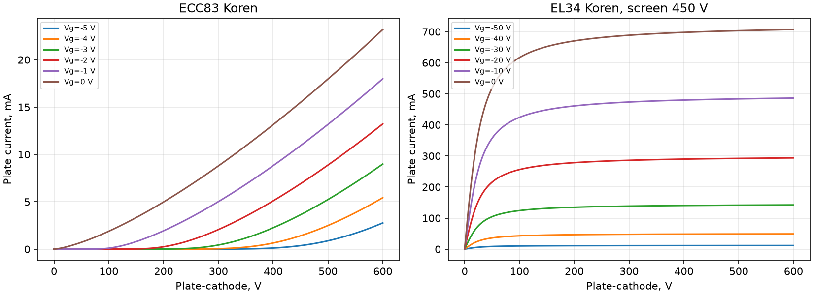

# Начальная проверка моделей ламп

Сравниваются две разные вещи: реализация закона (Python против ngspice)
и физическая точность начальных параметров (против табличных точек Philips).
Это не оцифровка всех заводских кривых и не подбор параметров.

Источники: [ECC83, 1970, стр. 2](https://www.drtube.com/datasheets/ecc83-philips1970.pdf)
и [EL34, 1969, стр. 2](https://www.drtube.com/datasheets/el34-philips1969.pdf).
Для EL34 взята колонка Rg2=0: Va=250 В, Vg1=−13,5 В, Vg2=265 В.

| Точка | Ia модель, мА | Ia Philips, мА | gm модель, мА/В | gm Philips, мА/В |
|:---|---:|---:|---:|---:|
| ECC83_100V | 0.100391 | 0.5 | 0.587610 | 1.25 |
| ECC83_250V | 0.951803 | 1.2 | 1.669980 | 1.6 |
| EL34_classA | 115.210333 | 100 | 12.990509 | 12.5 |

Экранный ток EL34: модель 5.759842 мА, Philips 14,9 мА.
Это существенное расхождение; перед исследованием питания и оконечного перегруза
экранный закон требует улучшения либо выбора другой проверенной модели.

Максимальное расхождение Python/ngspice по анодному току: 1.388e-17 А.
В сравнении учтён явно заданный резистор анод–катод 1 ГОм. Крутизна вычислена
центральной разностью с приращением сетки 0,1 мВ. Параметры не подгонялись.

Нарисованные кривые — модель Koren, а не экспериментальные точки Philips.
Отдельно ещё нужны проверка сеточного тока, ёмкостей и характеристик в области
катодного повторителя. Сходимость SPICE сама по себе не аттестует физику.
